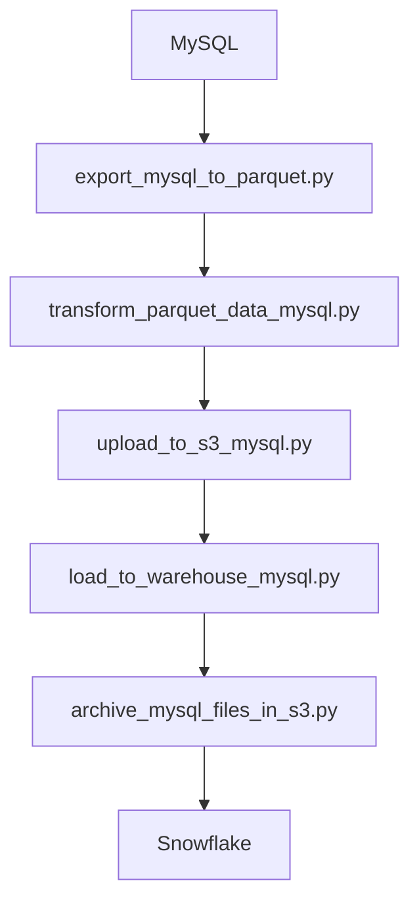

# MySQL to Snowflake CDC Data Pipeline

This project implements a robust data engineering pipeline that continuously ingests data from a MySQL database, detects changes (inserts, updates, deletes), transforms the data, uploads it to Amazon S3, and loads it into a Snowflake data warehouse using Apache Airflow.

## Features

- Change Data Capture (CDC) using hash comparison and shadow tables
- Handles inserts, updates, and deletes
- Data transformation with cleaning and normalization
- Chunked export to Parquet format
- Uploads to Amazon S3
- Loads into Snowflake using `COPY INTO` and `MERGE`
- Full logging and archival
- Modular design integrated into Apache Airflow DAGs
- Weekly full delete scan support using a dedicated shadow file

---

## Project Structure

```
src/
├── ingestion/
│   └── export_mysql_to_parquet.py
├── transformation/
│   └── transform_parquet_data_mysql.py
├── s3_upload/
│   └── upload_to_s3_mysql.py
├── loading/
│   └── load_to_warehouse_mysql.py
├── archiving/
│   └── archive_mysql_files_in_s3.py
├── utils/
│   └── db_config.py, suppress_warnings.py

dags/
└── pipeline_mysql_dag.py
└── weekly_mysql_deletion_dag.py

tasks/
├── export_mysql_to_parquet.py
├── transform_parquet_data_mysql.py
├── upload_to_s3_mysql.py
├── load_to_warehouse_mysql.py
├── archive_mysql_files_in_s3.py
└── weekly_delete_cdc.py
```

---

## Getting Started

### 1. Clone the Repo

```bash
git clone https://github.com/S-Gopisetty/highlevel_data_pipeline.git
cd highlevel_data_pipeline
```

### 2. Set Up Environment

```bash
python3 -m venv .venv
source .venv/bin/activate
pip install -r requirements.txt
```

### 3. Configure Environment Variables

Create a `.env` file in the project root:

```env
# AWS
AWS_ACCESS_KEY_ID=your_key
AWS_SECRET_ACCESS_KEY=your_secret
AWS_REGION=your_region
S3_BUCKET_NAME=your_bucket_name
S3_REVIEW_PREFIX=swiggy/reviews_parquet/

# Snowflake
SNOWFLAKE_USER=your_user
SNOWFLAKE_PASSWORD=your_password
SNOWFLAKE_ACCOUNT=your_account
SNOWFLAKE_WAREHOUSE=your_wh
SNOWFLAKE_DATABASE=your_db
SNOWFLAKE_SCHEMA=your_schema
SNOWFLAKE_ROLE=SYSADMIN
SNOWFLAKE_STAGE=amazon_stage

# MySQL
MYSQL_HOST=localhost
MYSQL_PORT=3306
MYSQL_USER=root
MYSQL_PASSWORD=your_password
MYSQL_DB=your_db
```

---

## Running the Pipeline

### Option 1: Run Manually

```bash
python src/ingestion/export_mysql_to_parquet.py
python src/transformation/transform_parquet_data_mysql.py
python src/s3_upload/upload_to_s3_mysql.py
python src/loading/load_to_warehouse_mysql.py
python src/archiving/archive_mysql_files_in_s3.py
```

### Option 2: Run with Airflow

1. Set `AIRFLOW_HOME` in environment (if needed)
2. Place DAG file inside `dags/`
3. Start scheduler and webserver:

```bash
airflow db init
airflow users create --username admin --password admin --role Admin --email admin@example.com --firstname Admin --lastname User
airflow scheduler
airflow webserver
```

4. Trigger the DAG via Airflow UI

---

## Logs

Logs are written to:

- `logs/` directory in project root
- Airflow task logs (accessible via UI)

---

## Data Flow



---

## Weekly Full Delete Detection

- Runs every Sunday via dedicated DAG
- Uses `reviews_shadow_weekly.parquet` for full comparison
- Detects deleted IDs and updates `deleted_reviews.parquet`
- Snowflake script removes rows using this list

---

## License

MIT

---

Maintained by **Surya**
